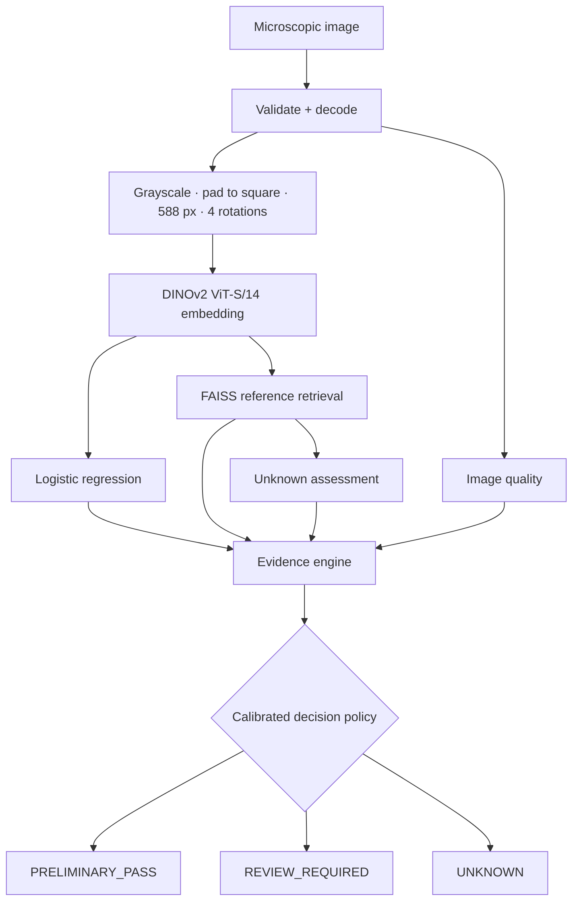

# HerbaScope X

**Evidence before confidence.** HerbaScope X is a local-first, evidence-driven screening system for
microscopic medicinal-plant material. It classifies a micrograph, shows the most similar reference
micrographs, estimates whether the sample is outside the known reference distribution, and applies
a deterministic, versioned policy to decide: **PRELIMINARY_PASS**, **REVIEW_REQUIRED** or **UNKNOWN**.

> HerbaScope X provides preliminary visual screening support and does not replace laboratory
> confirmation or expert botanical authentication.

- No cloud APIs, no LLM, no hardware. Inference runs on a CPU laptop, offline.
- Every number in the UI comes from real trained artifacts; every threshold is calibrated on data.
- Design rationale for every choice: [`docs/Architecture_Decisions.md`](docs/Architecture_Decisions.md).

---

## Contents

1. [How it works](#how-it-works)
2. [Current results](#current-results)
3. [Repository layout](#repository-layout)
4. [Quick start](#quick-start)
5. [Offline pipeline](#offline-pipeline)
6. [Running the app](#running-the-app)
7. [Tests and linting](#tests-and-linting)
8. [Docker](#docker)
9. [API](#api)
10. [Configuration](#configuration)
11. [Demo cases and offline rehearsal](#demo-cases-and-offline-rehearsal)
12. [Data, licenses and limitations](#data-licenses-and-limitations)
13. [Documentation map](#documentation-map)

---

## How it works



| Stage | What it does |
|---|---|
| Quality | Resolution, focus, exposure, clipping and specimen visibility, with bounds calibrated on reference training images |
| Encoder | Frozen DINOv2 ViT-S/14 at 588 px; CLS tokens of the last 4 blocks, each L2-normalised and concatenated (1536-d), averaged over 4 rotations |
| Classifier | Logistic regression trained on every rotation view; C chosen by validation log-loss |
| Retrieval | 40 curated reference micrographs (k-means medoids), exact cosine search |
| Unknown | Distance = 1 − mean similarity to the 5 nearest references; threshold chosen to minimise out-of-distribution false acceptance while keeping ≥ 95% known acceptance |
| Evidence | Agreement between classifier and retrieval, described as complementary analyses of the same representation, not independent tests |
| Decision | `UNKNOWN` if outside the distribution; `PRELIMINARY_PASS` only if confidence, similarity, risk, agreement and quality all pass; otherwise `REVIEW_REQUIRED` |

## Current results

From [`docs/reports/evaluation_report.md`](docs/reports/evaluation_report.md), on sets never used
for training or calibration:

| Set | What it is | Result |
|---|---|---|
| `test` (72) | Mikrobat, fragment types present in the reference library | **Accuracy 97.2%** (70/72); 19 PRELIMINARY_PASS, 18 correct; 1 of 2 misclassifications routed to REVIEW |
| `ood_evaluation` (200) | DIMPSAR field-leaf photos, classes not used in calibration | **200/200 UNKNOWN**, 0 false passes |
| `heldout_known` (104) | Mikrobat fragment types withheld from training and references | Accuracy 57.7%; 20 PRELIMINARY_PASS, 2 correct (see key finding) |

Ablation, measured on `test` and OOD:

| System | Test wrong-class accepted | OOD false acceptance |
|---|---|---|
| Classifier only | 2 | 100% |
| Full evidence + decision | 1 | 0% |

**Model improvement.** Pre-registered experiment ladders change one part of the embedding recipe
per rung and adopt it only if grouped cross-validation on the development pool improves. Test and
held-out results never decide. Each promoted selection is rebuilt and evaluated as a release.

| Release | Embedding recipe | CV accuracy | Test accuracy | Test passes (correct) | Held-out wrong-class passes |
|---|---|---|---|---|---|
| v1 | 224 px, final-block CLS, 1 view | - | 88.9% | 24 (24) | 31 |
| v2 | 448 px, last-4-block CLS, 4 rotations | 90.6% | 95.8% | 16 (15) | 10 |
| v3 | 518 px, last-4-block CLS, 4 rotations | 91.6% | 95.8% | 26 (26) | 27 |
| v4 (current) | 588 px, last-4-block CLS, 4 rotations | 92.0% | **97.2%** | 19 (18) | 18 |

Every release rejected all 200 OOD images. One analysis takes about 2.8 s on a laptop CPU.

**Key finding.** Screening conclusions only transfer to fragment types represented in the
reference library. On unseen fragment types, the classifier and retrieval can agree confidently
on the wrong class because they share one visual representation. The release table shows this
directly: on held-out fragment types, wrong-class passes swing between releases (31, 10, 27, 18).
Calibration covers only the represented material, so the PASS gate is no safeguard for material
the library does not contain.

## Repository layout

```text
apps/web/                 Next.js 16 frontend (App Router, TypeScript, Tailwind v4, Phosphor)
  app/                    /, /analyze, /results/[id], /history
  components/             upload/, analysis/, report/, history/, common/, motion/
  lib/api.ts              typed API client          types/index.ts   API contract types
  __tests__/              Vitest + Testing Library tests (fixtures captured from the real API)
services/api/app/         FastAPI service
  api/                    analyze, analyses, reference, health routers
  schemas/analysis.py     frozen response schema
  services/               inference_service, analysis_store (SQLite), reference_service
services/api/tests/       API tests
ml/                       shared ML library
  preprocessing/ encoders/ classifiers/ retrieval/ uncertainty/ evidence/ decision/
  inference/screening_pipeline.py   the one pipeline used by API, evaluation and smoke test
  training/               prepare_dataset, extract_embeddings, calibrate_quality, train_classifier,
                          build_index, calibrate_unknown, calibrate_decision, publish_release
  evaluation/evaluate.py  metrics, ablation, reports
  configs/pipeline.json   pinned sources, split policy, embedding recipe, calibration objectives
scripts/                  download_assets, run_pipeline, smoke_test, prepare_demo_cases
tests/                    ML unit + integration tests
docs/                     specifications, ADRs, generated reports (docs/reports/)
docker/                   api.Dockerfile, web.Dockerfile       docker-compose.yml
data/  models/            generated by the pipeline (git-ignored; see their READMEs)
```

## Quick start

**Prerequisites:** Python 3.12, Node.js 24 with pnpm 11, Git, and about 2 GB of free disk for
dependencies, datasets and weights. A GPU is not needed. Commands run from the repository root.

### Windows (PowerShell)

```powershell
py -3.12 -m venv .venv
.\.venv\Scripts\python -m pip install -r requirements-dev.txt
.\.venv\Scripts\python -m scripts.run_pipeline      # download, train, calibrate, evaluate (~30 min on a laptop CPU after downloads)
pnpm --dir apps/web install
```

### macOS / Linux

```bash
python3.12 -m venv .venv
.venv/bin/pip install torch==2.14.0 --index-url https://download.pytorch.org/whl/cpu   # Linux: CPU wheel
.venv/bin/pip install -r requirements-dev.txt
.venv/bin/python -m scripts.run_pipeline
pnpm --dir apps/web install
```

Then start both services (next section) and open <http://localhost:3000>.

## Offline pipeline

`python -m scripts.run_pipeline` runs every step in order. Use `--from <step>` to resume. Each
step can also be run on its own:

| Step | Command | Output |
|---|---|---|
| Download + pin assets | `python -m scripts.download_assets` | `data/raw/`, `models/pretrained/` with `SOURCE.json` receipts |
| Dataset lock | `python -m ml.training.prepare_dataset` | splits, manifest, `docs/reports/dataset_report.md` |
| Embeddings | `python -m ml.training.extract_embeddings` | `data/embeddings/*.npz` (cached by fingerprint), `models/configs/<encoder version>.json` |
| Quality bounds | `python -m ml.training.calibrate_quality` | `models/configs/<quality version>.json` |
| Classifier | `python -m ml.training.train_classifier` | `models/classifiers/classifier.joblib`, `label_encoder.json`, `training_config.json` |
| Reference index | `python -m ml.training.build_index` | `models/indexes/references.faiss`, `reference_metadata.json`, `data/references/` |
| Unknown calibration | `python -m ml.training.calibrate_unknown` | `models/classifiers/calibration.json` |
| Decision calibration | `python -m ml.training.calibrate_decision` | `models/configs/<decision version>.json` |
| Publish release | `python -m ml.training.publish_release` | `models/manifest.json` (loads and cross-checks the full pipeline, records SHA-256 of every artifact) |
| Evaluation | `python -m ml.evaluation.evaluate` | `models/reports/`, `docs/reports/evaluation_report.md` |
| Demo cases | `python -m scripts.prepare_demo_cases` | `data/demo/*.png`, `docs/reports/demo_cases.md` |
| Smoke test | `python -m scripts.smoke_test [image]` | one full inference printed as JSON |

On Windows use `.\.venv\Scripts\python`; on macOS/Linux use `.venv/bin/python`. The pipeline is
deterministic: every source is pinned and every choice has a seed.

### Model-improvement experiments

Changes to the embedding recipe are tested before they reach `pipeline.json`. Each phase is a
ladder registered in git (`ml/configs/experiments-v*.json`) before it runs: a hypothesis per rung,
the primary metric, the adoption rule and a latency budget.

```powershell
.\.venv\Scripts\python -m ml.experiments.run_experiments --config ml/configs/experiments-v2.json
```

A rung is adopted only if it raises out-of-fold accuracy from grouped, stratified 5-fold
cross-validation on train + validation (or ties with lower log-loss) and encodes an image within
3 s. Test and held-out accuracy are reported for every rung but never decide adoption. Output:
`models/experiments/<ladder>.json` and `docs/reports/model_improvement_<ladder>.md`. Token
features are cached per backbone and resolution, so rungs that only change pooling or views do
not re-encode.

## Running the app

Two terminals, both started from the repository root:

```powershell
# 1. API (loads all artifacts once at startup)  ->  http://localhost:8000/docs
.\.venv\Scripts\python -m uvicorn app.main:app --app-dir services/api --port 8000
```

```powershell
# 2. Web  ->  http://localhost:3000
pnpm --dir apps/web dev
```

On macOS/Linux, replace `.\.venv\Scripts\python` with `.venv/bin/python`. Copying `.env.example`
to `.env` and `apps/web/.env.example` to `apps/web/.env.local` is only needed when you change the
defaults. If the artifacts are missing, the API starts in **degraded mode**: `/health` explains
what is missing and the UI blocks uploads.

## Tests and linting

```powershell
.\.venv\Scripts\python -m pytest            # ML units, synthetic end-to-end API, real-artifact integration
.\.venv\Scripts\python -m ruff check .
.\.venv\Scripts\python -m ruff format --check .
pnpm --dir apps/web test                    # Vitest + Testing Library
pnpm --dir apps/web lint
pnpm --dir apps/web typecheck
pnpm --dir apps/web build
```

Tests marked `artifacts` use the real trained models and are skipped automatically until
`run_pipeline` has been executed.

## Docker

Build the artifacts on the host first (`run_pipeline`); they are mounted, not baked into images.

```bash
docker compose up --build
```

- Web: <http://localhost:3000>. API: <http://localhost:8000/docs>.
- `models/` is mounted read-only. `data/` is mounted read-write for the reference images and the
  analysis history.
- The browser-facing API URL is a build argument (`NEXT_PUBLIC_API_BASE_URL`) in
  `docker-compose.yml`.

## API

Base URL `http://localhost:8000/api/v1` (OpenAPI UI at `/docs`).

| Method | Path | Purpose |
|---|---|---|
| POST | `/analyze` | multipart field `image` → full screening result (413 too large, 415 wrong type, 422 unreadable, 503 models not loaded) |
| GET | `/analyses?limit=50` | recent analyses, newest first |
| GET | `/analyses/{id}` | stored screening result |
| GET | `/analyses/{id}/image` | normalised sample image |
| GET | `/reference/{reference_id}` | reference metadata |
| GET | `/reference/{reference_id}/image` | reference micrograph |
| GET | `/health` | API, model and index status; artifact versions; upload limit |

Response blocks follow the frozen contract: `prediction`, `retrieval`, `unknown`, `evidence`,
`decision`, `model`. For transparency they also include `decision.thresholds`, `decision.checks`,
`evidence.quality.checks`, `explanation`, `limitations` and `disclaimer`. Types:
[`services/api/app/schemas/analysis.py`](services/api/app/schemas/analysis.py) and
[`apps/web/types/index.ts`](apps/web/types/index.ts).

## Configuration

API (`.env` in the repository root, see [`.env.example`](.env.example)):

| Variable | Default | Meaning |
|---|---|---|
| `MODEL_DIR` | `./models` | Model release root; artifacts are located through `manifest.json` and hash-verified |
| `DATA_DIR` | `./data` | Data root; reference images are resolved inside it |
| `APP_STATE_DIR` | `./data/app` | SQLite history + stored samples |
| `CORS_ORIGINS` | `http://localhost:3000` | Comma-separated allowed origins |
| `MAX_UPLOAD_MB` | `10` | Upload limit (also shown by the UI) |
| `LOG_LEVEL` | `INFO` | Logging level |

Web (`apps/web/.env.local`, see [`apps/web/.env.example`](apps/web/.env.example)):
`NEXT_PUBLIC_API_BASE_URL=http://localhost:8000/api/v1`.

Pipeline choices (sources, seed, split ratios, calibration objectives):
[`ml/configs/pipeline.json`](ml/configs/pipeline.json). **Calibrated values are never edited
by hand.** They are written by the calibration steps into `models/`.

## Demo cases and offline rehearsal

`prepare_demo_cases` picks three **real evaluation images** into `data/demo/`
([details](docs/reports/demo_cases.md)):

| File | Expected decision | Why |
|---|---|---|
| `strong_evidence.png` | PRELIMINARY_PASS | Mikrobat test image; confident classifier, unanimous references, low risk |
| `conflicting_evidence.png` | REVIEW_REQUIRED | Held-out sirih; the classifier says sirih, the reference library favours sirih_merah |
| `unknown.png` | UNKNOWN | DIMPSAR field photo; the classifier alone would say "sirih" at 71.5% |

Offline checklist:
1. Run `run_pipeline` once while online (it downloads datasets and DINOv2 weights).
2. Run `pnpm --dir apps/web install` once. Fonts are bundled, so no font download happens at
   build time.
3. Disconnect from the network, start the API and web app, and upload the three demo files.
4. `python -m scripts.smoke_test data/demo/unknown.png` verifies inference without the UI.

## Data, licenses and limitations

| Source | Role | License |
|---|---|---|
| [Mikrobat](https://github.com/alamraya/Mikrobat) @ `063b0e5` | Training, references, validation, test, held-out known material | The repository does not include a license file |
| [DIMPSAR](https://huggingface.co/datasets/Project-AgML/DIMPSAR_medicinal_plant_classification) @ `eb460a4` | Far-OOD negative set only (never a training class) | CC BY 4.0 |
| [DINOv2 ViT-S/14](https://huggingface.co/facebook/dinov2-small) @ `ed25f3a` | Frozen encoder | Apache-2.0 |

Verified counts are in [`docs/reports/dataset_report.md`](docs/reports/dataset_report.md):
716 files, 655 unique, 591 usable, and 53 images filed byte-identically under both classes.

**Limitations**
- Only two species (`sirih`, `sirih_merah`) are supported. Other material can only be flagged as
  not matching, never identified.
- Because Mikrobat contains only two species, true held-out-species OOD calibration was not
  possible. HerbaScope X therefore uses held-out Mikrobat specimen/fragment groups to characterize
  within-distribution variability and DIMPSAR field-leaf imagery as a far-OOD negative set. The
  unknown threshold is calibrated against these distributions and evaluated separately for
  known-material retention and OOD rejection.
- DIMPSAR is a *modality* far-OOD set: its `Betel` class is the same species as `sirih`,
  photographed in the field.
- Species and fragment type are confounded in Mikrobat. Conclusions do not transfer to fragment
  types absent from the reference library.
- Mikrobat has no specimen identifiers. Overlapping crops of one source micrograph may cross
  splits, which can make test metrics optimistic.
- This is reference-consistency screening, **not adulteration detection**, authentication,
  diagnosis or certification.

## Documentation map

| Document | Content |
|---|---|
| [`docs/Project_Explained.md`](docs/Project_Explained.md) | The whole project explained in plain language and technical detail: problem, solution, ML, data, architecture, stack choices, creative decisions |
| [`docs/Architecture_Decisions.md`](docs/Architecture_Decisions.md) | Why every component is built the way it is (ADR-001 … 023) |
| [`docs/reports/dataset_report.md`](docs/reports/dataset_report.md) | Generated dataset lock: counts, duplicates, splits, licenses |
| [`docs/reports/evaluation_report.md`](docs/reports/evaluation_report.md) | Generated metrics, calibration, decision counts, ablation, findings |
| `docs/reports/model_improvement_experiments-v*.md` | Generated model-improvement logs, one per phase: pre-registered ladder, cross-validated accuracy, adoption decisions |
| [`docs/reports/demo_cases.md`](docs/reports/demo_cases.md) | Generated presentation cases |
| [`docs/Architecture.md`](docs/Architecture.md) | Original technical architecture specification (with implementation status) |
| [`docs/Data_Set.md`](docs/Data_Set.md) | Microscopy-first dataset specification (with implementation status) |
| [`docs/Project_Report.md`](docs/Project_Report.md) | Project report (with implementation status) |
| [`docs/prompt.json`](docs/prompt.json) | Original build specification |
| [`data/README.md`](data/README.md), [`models/README.md`](models/README.md) | Generated file layouts |
