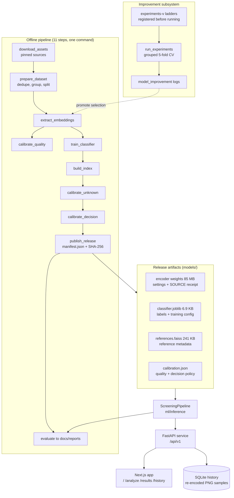
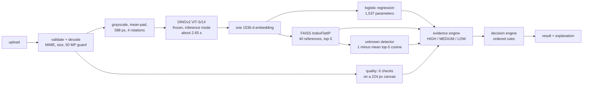

# HerbaScope - End-to-End Architecture

How a micrograph becomes a screening decision, from pinned data sources to the browser. Design
rationale for each choice lives in [`Architecture_Decisions.md`](Architecture_Decisions.md); the
numbers quoted here come from the generated reports in [`reports/`](reports/) for the current
release (`pipeline-v4`).

## 0. The contract

Every analysis returns exactly one of three outcomes - `PRELIMINARY_PASS`, `REVIEW_REQUIRED`,
`UNKNOWN` - together with every input that produced it. No number in the product is typed in by
hand: thresholds are calibrated against written objectives, and each result names the artifact
versions behind it.

## 1. System map

## 2. Data layer

**Sources, pinned.** Mikrobat at commit `063b0e5` provides training, reference, test and held-out
material. A seeded DIMPSAR subset at a pinned revision, SHA-256 verified on download, is used
**only** as far-out-of-distribution negatives and never as a training class.

**The lock step** (`ml/training/prepare_dataset.py`) does the honest work before any model sees an
image:

- 716 files reduce to 655 unique images by SHA-256, and 591 usable after curation;
- 53 byte-identical images filed under *both* species become a separate **ambiguity probe**, never
  training data;
- near-duplicates are linked by 64-bit pHash with a cut-off taken from the **cross-species null
  distribution** (images of different species cannot come from one specimen), and **groups, not
  images, are the split unit**;
- splits: **train 341 / validation 74 / test 72**, plus **104 held-out known-material** images
  (whole fragment types withheld from training and from the reference library) and **two disjoint
  sets of 200 DIMPSAR images** for unknown calibration and for OOD evaluation.

## 3. Offline pipeline

`python -m scripts.run_pipeline` runs eleven steps in order; `--from <step>` resumes:

`download_assets`, `prepare_dataset`, `extract_embeddings`, `calibrate_quality`,
`train_classifier`, `build_index`, `calibrate_unknown`, `calibrate_decision`, `publish_release`,
`evaluate`, `prepare_demo_cases`.

Each step writes a versioned artifact; no step reaches into another step's state.

## 4. The release: integrity layer

`ml/training/publish_release.py` loads the complete pipeline first, so fingerprint, index-version
and class checks must pass, then writes `models/manifest.json` listing **twelve artifact roles,
each with its SHA-256**.

Two invariants make artifacts impossible to mix:

- the **embedding fingerprint**
  `DINOv2 ViT-S/14@ed25f3a31f01|preprocess-v1|size=588|pool=cls_last4|views=4|dim=1536`
  is written into every artifact and cross-checked when the pipeline loads;
- the API, the evaluation harness and the smoke test locate artifacts **only** through the
  manifest, and the hashes are verified again at load time.

## 5. Runtime path

About 2.8 s per analysis on a laptop CPU, fully offline.

The encoder is the only expensive stage. Everything after it is one dot product, an exact search
over 40 vectors and five comparisons.

**Decision rules, in order** (`ml/decision/decision_engine.py`):

1. unknown status `UNKNOWN` gives **UNKNOWN**: reference distance above 0.181, with 0.117 as the
   boundary above which a sample counts as atypical;
2. all five criteria met gives **PRELIMINARY_PASS**: classifier confidence at least 0.627, top
   reference similarity at least 0.897, unknown risk at most 0.042, evidence agreement HIGH and
   image quality ACCEPTABLE;
3. anything else gives **REVIEW_REQUIRED**, and the reason names every criterion that failed.

`ml/inference/screening_pipeline.py::ScreeningPipeline` is the single class used by the API, the
evaluator and the smoke test, so the numbers in the evaluation report describe the behaviour of the
running application.

## 6. API service

FastAPI under `/api/v1`: `POST /analyze`, `GET /analyses`, `GET /analyses/{id}`,
`GET /analyses/{id}/image`, `GET /reference/{id}`, `GET /reference/{id}/image`, `GET /health`.

- **Upload safety**: MIME allow-list (415), size cap read with a one-byte overflow check (413),
  full decode with a 50-megapixel guard (422), server-generated UUIDs with strict id patterns, and
  path containment for reference images. Uploaded bytes are never stored or served back; samples
  are re-encoded to PNG.
- **Persistence**: SQLite under `APP_STATE_DIR`, with no server, credentials or migrations.
- **Concurrency**: inference runs behind a lock, because the encoder already uses every core.
- **Degraded mode**: missing or mismatched artifacts do not crash the service. `/health` explains
  what is wrong, `/analyze` returns 503, history stays browsable, and no placeholder prediction is
  ever shown.

## 7. Frontend

Next.js 16 App Router with four routes: `/` (marketing, a vertical page with two horizontal-scroll
sections), `/analyze`, `/results/[id]` and `/history`. Data is fetched client-side through a typed
client that mirrors the frozen API schema.

The result page is the product: the decision and its reason first, then class probabilities with
the policy threshold drawn on the bar, the five nearest reference micrographs (each openable beside
the sample in a native `<dialog>`), the distance gauge with the calibrated boundaries marked, six
quality checks, and the artifact versions that produced the result.

Motion rule (ADR-023): the finished state is always the base state and numbers never animate, so a
paused, disabled or printed animation still shows the measured value.

## 8. Improvement subsystem

A parallel offline path that feeds the pipeline. Ladders in `ml/configs/experiments-v*.json` are
committed **before** they run. `ml/experiments/run_experiments.py` scores each rung by grouped
stratified 5-fold cross-validation over the 415 development images, caching encoder tokens per
backbone and resolution so that pooling and view changes cost nothing to re-evaluate, and writes a
generated log per phase.

A rung is adopted only by that rule plus a 3 s latency budget; validation, test and held-out results
are reported for every rung and never decide. Adopted selections are promoted into
`ml/configs/pipeline.json` with bumped artifact versions and rebuilt as a new release. Releases v1
to v4 took cross-validated accuracy from 87.5% to 92.0% and test accuracy from 88.9% to 97.2%; see
[`Model_Improvement_Journey.md`](Model_Improvement_Journey.md).

## 9. Quality gates

114 Python tests: units for every component, a synthetic end-to-end pipeline built from the *real*
training and calibration functions with a deterministic encoder double, API tests, and
real-artifact integration tests that skip themselves when no release has been built. Plus 27
frontend tests, ruff, TypeScript and a production build. GitHub Actions runs all of it on every
push and pull request.

## 10. Deployment

**Today.** `docker compose up --build` starts the API container (CPU-only PyTorch, `./models`
mounted read-only) and the web container, which waits for the API health check.

**Production path.** CloudFront and WAF at the edge, API Gateway with a Cognito JWT authorizer, a
VPC Link to ECS Fargate in private subnets, SQS with a worker service and dead-letter queue for
asynchronous jobs, S3 for images and versioned model artifacts (checksum-verified at container
boot), RDS PostgreSQL as the metadata system of record, CloudWatch and X-Ray for observability, and
GitHub OIDC into ECR and ECS for deployment. Managed services are reached over VPC endpoints rather
than placed inside subnets.

## Cross-cutting invariants

1. No fabricated numbers: everything shown comes from an artifact the pipeline produced.
2. No hand-chosen thresholds: each is calibrated against a written objective and stored with its
   provenance.
3. One embedding, three readers, described as complementary analyses of the same representation and
   never as independent evidence.
4. Versioned, hash-verified artifacts; an incompatible combination refuses to load.
5. Deterministic by construction: pinned sources, seeded splits, and no language model anywhere in
   the decision path.
