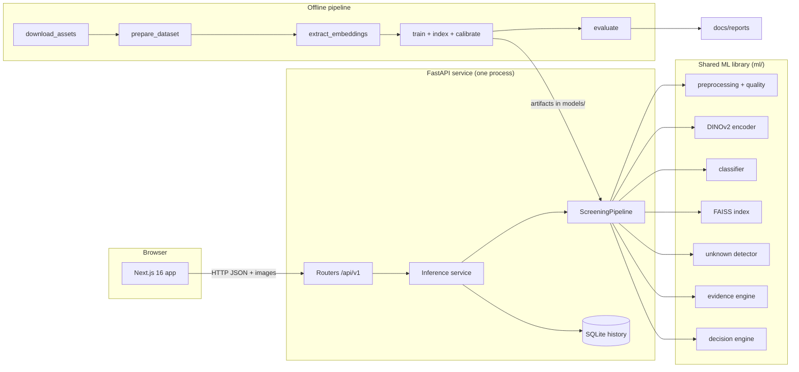

# HerbaScope X — The Project Explained

This document explains the whole project twice: in **plain language** (for judges, teammates and
anyone new) and in **technical detail** (for engineers). Every number below was measured on this
project's real data and artifacts. Design decisions are cross-referenced to
[`Architecture_Decisions.md`](Architecture_Decisions.md) (ADR-xxx).

---

## 1. The one-minute version

**Plain language.** Herbal medicines are made from dried, powdered plant material. One way to
check that the right plant is in the bag is to look at the powder under a microscope and compare
the tiny structures you see (cell walls, hairs, crystals, pores) with known reference samples. This
takes an expert. HerbaScope X helps with the first look. You upload a microscope photo, and it says:

- **Preliminary pass**: this looks strongly and consistently like a supported reference plant;
- **Review required**: the evidence is mixed, so a person should look; or
- **Unknown**: this does not look like anything in our reference library, so we won't guess.

The key idea is in the tagline **"Evidence before confidence."** Most AI demos show a single
confident answer. HerbaScope X shows *why*: the similar reference images it found, how far the
sample is from known material, whether different checks agree, and the exact rules behind the
decision.

**Technical.** A local-first pipeline: frozen DINOv2 ViT-S/14 embeddings feed (a) a logistic-
regression classifier, (b) exact FAISS retrieval over a curated reference library, and (c) a
reference-distance out-of-distribution detector calibrated on real data. An evidence engine
compares these signals, and a deterministic, versioned policy produces
`PRELIMINARY_PASS / REVIEW_REQUIRED / UNKNOWN`. The system is served by FastAPI and a
Next.js 16 UI, and runs fully offline on a laptop CPU in about 2.8 s per image.

---

## 2. The problem

### Plain language
A normal image classifier is like a student who *must* pick an answer on a multiple-choice test,
even when the right answer isn't on the list. Show it a photo of a leaf in a garden and it will
still say "sirih, 71.5% sure", because it only knows two answers. A high percentage does not mean
the answer deserves trust.

For screening medicinal material, that behaviour is dangerous. The useful questions are:

1. Does this sample actually resemble our known reference material?
2. Do the reference images agree with the prediction?
3. Is the sample outside what the system knows?
4. Is the image good enough to judge?
5. Should a human look at it?

### Technical
Closed-set classifiers produce a softmax over known classes with no rejection option. Softmax
confidence is poorly suited to out-of-distribution detection. Our own measurement shows this: on
200 DIMPSAR field photographs, **a classifier-only system accepted 100%** of them as one of the
two microscopy classes. The decision gap is between "a prediction exists" and "the prediction is
supported by evidence".

---

## 3. The solution idea

### Plain language
Instead of trusting one answer, HerbaScope X gathers several kinds of evidence and only says
"pass" when all of them line up:

| Evidence | Simple meaning |
|---|---|
| **Model prediction** | "Which supported plant does this look most like?" |
| **Reference evidence** | "Show me the most similar real reference micrographs. Are they the same plant?" |
| **Unknown risk** | "How far is this sample from everything in the reference library?" |
| **Image quality** | "Is the photo sharp, well exposed and actually showing a specimen?" |
| **Decision rules** | "Written, versioned rules decide, not a black box." |

### Technical
The product is the **evidence-to-decision layer** around the classifier:

```text
image -> validation -> quality -> preprocessing -> DINOv2 embedding
                                                     |-> classifier (probabilities)
                                                     |-> FAISS retrieval (top-5 references)
                                                     |-> unknown detector (reference distance)
                     evidence engine (agreement, strength, summary)
                     decision engine (ordered deterministic rules, calibrated policy)
                     explanation (deterministic template)
```

The classifier and retrieval are **complementary analyses of the same visual representation**.
They are not independent tests, and the system never claims they are (see §6.6).

---

## 4. What happens when you upload an image

### Plain language, step by step
1. **You drop a micrograph** on the Analyze page. The browser checks it is an image and not too
   big.
2. **The server double-checks the file.** It must really open as an image, have a supported
   format and stay under the size limit.
3. **It checks photo quality**: focus, brightness, overexposure, and whether there is enough
   detail.
4. **It prepares the image the same way every time**: black-and-white, padded to a square (never
   cropped), and resized.
5. **An "expert eye" turns the image into 1,536 numbers** that describe what it looks like. It
   looks at the image in four rotations and averages them, because a microscope slide has no
   "right way up".
6. **Three analyses read those numbers**: a classifier guesses the plant, a search engine finds
   the 5 most similar reference images, and a distance check measures how unusual the sample is.
7. **The evidence engine compares them.** Do the references agree with the prediction? How strong
   is the evidence overall?
8. **The decision engine applies fixed rules** and writes the reason.
9. **You see everything** on the result page: the sample, the decision with every criterion, the
   5 reference images, the distance gauge, the quality checks and the model versions. The result
   is saved to the local history.

### Technical, per stage
| Stage | Implementation | File |
|---|---|---|
| Upload | `POST /api/v1/analyze`, multipart field `image`, MIME allow-list (415), size cap read with a one-byte overflow check (413) | `services/api/app/api/analyze.py` |
| Decode | Pillow `verify()`, then a full decode, a format allow-list, a 50 MP memory guard, EXIF orientation (422 on failure) | `ml/preprocessing/image_io.py` |
| Quality | Laplacian variance, mean brightness, clipped-pixel fraction, 8×8 tile detail coverage on a 224-px short-side canvas | `ml/preprocessing/quality.py` |
| Transform | grayscale → mean-pad to square → bicubic 588 → ImageNet normalisation (`preprocess-v1`); four rotations | `ml/preprocessing/transforms.py` |
| Embedding | DINOv2 ViT-S/14; layer-normalised CLS token of each of the last 4 blocks, each L2-normalised and concatenated (1536-d), averaged over the 4 rotations and L2-normalised | `ml/encoders/dinov2_encoder.py` |
| Classifier | `LogisticRegression.predict_proba` | `ml/classifiers/classifier.py` |
| Retrieval | FAISS `IndexFlatIP` top-5 + similarity-weighted class vote | `ml/retrieval/faiss_store.py` |
| Unknown | distance = 1 − mean(top-5 cosine), threshold/boundary, logistic risk | `ml/uncertainty/unknown_detector.py` |
| Evidence | agreement HIGH/MEDIUM/LOW, strength (geometric mean), summary | `ml/evidence/evidence_engine.py` |
| Decision | ordered rules over the calibrated policy | `ml/decision/decision_engine.py` |
| Orchestration | one class runs all of the above; the same class runs in evaluation | `ml/inference/screening_pipeline.py` |
| Persistence | SQLite row + re-encoded PNG sample | `services/api/app/services/analysis_store.py` |

Measured on the development laptop (AMD Ryzen 7 7735HS, CPU only) by `scripts.smoke_test`:
loading all artifacts takes 0.85 s once at startup; one analysis takes about **2.8 s**, almost
all of it encoding the four rotations. The 3 s latency budget is part of every
model-improvement experiment (§7.1).

---

## 5. "Did we train an AI model?" — the ML, honestly explained

### 5.1 We did not train a deep neural network from scratch, and we did not fine-tune one

**Plain language.** Training an image model from scratch is like teaching someone to see from
birth. It needs millions of images and lots of GPU time. We have **341 training images** and a
laptop, so we don't do that.

Instead we **borrow a pair of very experienced eyes**: **DINOv2**, a vision model Meta AI
already trained on a huge, general collection of images. We use it **frozen**, meaning we never
change it. It looks at a micrograph and writes down 1,536 numbers describing the textures, edges,
shapes and patterns it sees. That list of numbers is called an **embedding**. It works like a
fingerprint of what the image looks like: similar-looking images get similar fingerprints.

On top of those fingerprints we train only a **tiny model**, a logistic regression. It learns
**1,537 numbers** (one weight per embedding value, plus one offset) and trains in seconds. By
comparison, DINOv2 has **22,056,576** parameters, and we train none of them.

**Technical.**
- **Encoder:** `facebook/dinov2-small` (ViT-S/14, 22.06 M parameters), pinned revision
  `ed25f3a`, loaded with `local_files_only=True`, run under `torch.inference_mode()`. It sees a
  588×588 input as 42×42 = 1,764 patches plus a CLS token.
- **Embedding recipe** (ADR-020): from each of the last four transformer blocks we take the CLS
  token, apply the model's final layer norm, L2-normalise it, and concatenate the four (1,536-d).
  This is repeated for the image rotated by 0°, 90°, 180° and 270°; the four vectors are averaged
  and L2-normalised, so inner product = cosine similarity. The recipe was chosen by the
  experiments in §7.1.
- **Why frozen features work.** DINOv2 is trained with self-supervised objectives
  (self-distillation plus masked-patch objectives) that produce general-purpose features. Its
  authors evaluate those features with linear probes and k-nearest-neighbour retrieval, which is
  exactly what we do.
- **Why not a CNN from scratch?** With 341 images it would memorise the training set, take GPU
  time to tune, and add failure modes.
- **Why not fine-tune DINOv2?** It adds a deep training loop, hyperparameters and overfitting risk
  on tiny data. It would also break the property that the embedding space is fixed and shared by
  the classifier, the reference index and the calibration.

### 5.2 What the embedding gives us
One embedding is reused **three ways**:
- the classifier reads it;
- the search index compares it with the reference embeddings;
- the unknown detector measures its distance to the reference library.

Because all three share it, we track an **embedding fingerprint**
(`DINOv2 ViT-S/14@ed25f3a31f01|preprocess-v1|size=588|pool=cls_last4|views=4|dim=1536`) inside
every saved artifact. If anyone
swaps the model or changes preprocessing without rebuilding, the API refuses to mix incompatible
pieces (ADR-006).

### 5.3 The classifier (logistic regression)
**Plain language.** It draws the best dividing line between "sirih" fingerprints and
"sirih merah" fingerprints and reports how far a new sample sits on either side, as a
probability.

**Technical.** scikit-learn `LogisticRegression`, balanced class weights. The regularisation
strength `C` is selected from {0.01 … 10,000} by **validation log-loss**. Log-loss is a proper
scoring rule, so it rewards honest probabilities, not just correct labels. The winner was C = 100,
an interior optimum. We widened the grid once, when the best value sat on its edge. The model is
fitted on the training split only, which keeps the validation split clean for calibration. Each of
the four rotations of a training image is a separate training row (1,364 rows from 341 images), a
free, label-preserving augmentation. Validation accuracy: 94.6%.

### 5.4 Reference retrieval (the "show me similar examples" part)
**Plain language.** From the training images we picked **20 representative reference images per
plant** (40 in total) — like a small reference atlas. For a new sample we find the 5 most
similar references and **show them**, so a person can compare with their own eyes.

**Technical.** For each class, training images whose quality is DEGRADED are dropped. We run
k-means (k = 20) on the rest and keep the real image nearest each centroid (a medoid), giving
representative, diverse, real references. The index is FAISS `IndexFlatIP`: exact search on
normalised vectors (cosine), deterministic and sub-millisecond at this size. The retrieved class
is a similarity-weighted vote over the top 5, with ties going to the best single match. The build
script **refuses** to index any image that also appears in validation, test, held-out, probe or
OOD splits (ADR-008).

### 5.5 Unknown detection (the "I don't know" skill)
**Plain language.** We measure how far the sample is from its 5 nearest references. If it is
much farther than genuine samples ever are, the answer is **Unknown**. If it is a bit unusual but
not that far, the status is **Uncertain**, and the system asks for review instead of passing it.

The cut-off is **not a guessed number**. We measured distances for genuine Mikrobat validation
samples and for 200 unrelated field photos, then chose the cut-off by a written rule: *reject as
many outsiders as possible while still accepting at least 95% of genuine samples.*

**Technical.**
- `distance = 1 − mean cosine similarity to the 5 nearest references`.
- **Threshold selection**: minimise OOD false acceptance subject to known acceptance ≥ 95%. The
  smallest feasible threshold is the *known boundary* (0.117). The false-acceptance rate stays
  constant up to the next OOD distance, so we take the midpoint of that interval to maximise the
  margin: **0.181**.
- **Status**: distance > 0.181 → UNKNOWN; > 0.117 → UNCERTAIN; else KNOWN.
- **Risk**: a 1-D logistic model P(OOD | distance), fitted with balanced classes on a
  standardised feature and mapped back to raw units.
- **Calibration data**: Mikrobat validation (74) plus DIMPSAR calibration classes (200).
  Evaluation uses a *different* set of DIMPSAR classes (200), so the result is not measured on
  data it was tuned on.
- Measured separation: genuine validation distances max 0.142; DIMPSAR calibration min 0.245.
  (The absolute values are smaller than in release v1 because the richer embedding places all
  micrographs closer together; the thresholds are recalibrated with every release.)

### 5.6 Image quality
**Plain language.** Blurry, too-dark or empty images get flagged. Quality can only turn a
"pass" into "review". It never changes *which* plant the system thinks it is.

**Technical.** Six checks: resolution, focus (variance of the Laplacian), under-exposure,
over-exposure, clipping (pure black/white pixel fraction), and specimen visibility (share of 8×8
tiles with detail above a floor). Bounds are percentile 1 / 99 of the Mikrobat training images,
i.e. "more extreme than 99% of the material the model was built from". The minimum side of
224 px is a technical rule: smaller images must be upscaled, so the encoder would see invented
detail (ADR-011).

### 5.7 Evidence engine
**Plain language.** It asks, "do the prediction and the reference images tell the same story?"
- **HIGH**: all 5 nearest references are the predicted plant.
- **MEDIUM**: most are.
- **LOW**: the references point to the other plant.

It also computes an **evidence strength** score for display.

**Technical.** The agreement levels are structural definitions with no tuned numbers. Evidence
strength is the **geometric mean** of four components: classifier confidence, reference support
for the predicted class, 1 − unknown risk, and the quality pass fraction. A geometric mean
collapses when any single component is weak. Strength is shown as a descriptive index and is
**deliberately not used** by the decision rules, so there is no second, uncalibrated way to
decide.

### 5.8 Decision engine
**Plain language.** Written rules, applied in order:
1. If the sample is **Unknown**, the answer is Unknown.
2. If **every** pass condition holds, the answer is Preliminary pass: confident prediction,
   close references, low unknown risk, references all agree, good image quality.
3. Otherwise, the answer is Review required, and the reason lists exactly which conditions failed.

**Technical.** `ml/decision/decision_engine.py`. The policy file
`models/configs/decision-v4.json` is calibrated on validation data:

| Value | How it was derived | Result |
|---|---|---|
| `min_classifier_confidence` | smallest confidence with ≥ 95% selective accuracy on validation | 0.627 (achieved 95.9%, 98.6% coverage) |
| `min_reference_similarity` | keeps 95% of correctly classified validation samples | 0.897 |
| `max_unknown_risk` | unknown risk at the known boundary | 0.042 |

No model, language model or UI can override the result. The API also returns every criterion with
its observed and required values, and the UI shows them as a table.

### 5.9 Explanation, without an LLM
The plain-English summary is built from **fixed sentence templates** filled with the structured
numbers. A language model could invent biological facts or contradict the decision; templates
cannot, and they work offline (ADR-017).

---

## 6. The data — what we used, what we found, how we kept it honest

### 6.1 Datasets
| Dataset | Role | Notes |
|---|---|---|
| **Mikrobat** (GitHub, commit `063b0e5`) | Training, references, validation, test, held-out material | Microscopic fragments of dried betel-leaf simplicia; 2 classes (`sirih`, `sirih_merah`); 300×300. The repository does not include a license file. |
| **DIMPSAR** (Hugging Face, revision `eb460a4`) | Far-out-of-distribution negatives only | Field photographs of 40 medicinal plants, CC BY 4.0. Never a training class. |
| SimpliScopeX, MPalyn | Considered | Not obtainable when checked: SimpliScopeX's repository has a model but no images; the MPalyn site returned 404. |

Every download is pinned (commit, revision, SHA-256) and writes a receipt, so the dataset is
reproducible.

### 6.2 What the data audit found
- **716 files, but only 655 unique images.**
- **53 images are byte-identical under both species.** The exact same file is labelled as two
  different plants.
- 8 more are exact duplicates within one class.
- Some **near-identical micrographs are also filed under both species**. One was confirmed by
  looking at the pair side by side.
- Every file is stored as RGB, but all 716 have identical R, G and B channels. The images are
  really grayscale.
- Species and fragment type are **confounded**: after cleaning, the two classes share no
  fragment-type label. For example, the xylem images belong to only one class.

### 6.3 Duplicate detection — a data-derived rule instead of a guess
**Plain language.** We needed to know when two images are "basically the same photo", so that a
photo and its near-copy never end up split between training and testing. Otherwise the model
gets to "cheat" on the test.

The trick: **two images of different species can never be photos of the same physical
specimen.** So we measured how similar cross-species pairs typically are and used that as the
"definitely different images" baseline. Pairs that are more similar than 99.99% of those
baselines are treated as near-duplicates.

**Technical.** A 64-bit DCT perceptual hash (pHash). The null distribution is the Hamming
distance over 88,920 cross-class pairs. Pairs with distance below its 0.01th percentile (< 16)
are linked, and links are merged transitively (union-find) into groups. Groups are the split unit.
A group spanning both classes is a label conflict and is excluded. Before settling on this we
tested alternatives and **rejected them with evidence**:
- *Fixed Hamming cut-off*: true duplicates appear at 10–16, and a distinct pair at 10.
- *Pixel correlation*: a confirmed duplicate scored 0.75, while non-duplicate candidate pairs
  scored up to 0.91.
- *DINOv2 cosine*: semantic, not copy-specific; a confirmed duplicate scored 0.88, while a
  visually different pair scored 0.97.
- *ORB keypoint matching*: degenerate RANSAC produced 250+ "matches" between unrelated images.

### 6.4 Splits
- **Train / validation / test**: 341 / 74 / 72 images. Group-aware, stratified by class ×
  fragment type, seed `20260915`.
- **Held-out known material (104)**: one whole fragment type per species, never seen in
  training or references. It tests "genuine material of a known plant, but a structure the
  library doesn't contain". These are called *held-out known-material samples*, never "unknown
  species".
- **Ambiguity probe (53)**: the label-conflict images, reported separately.
- **DIMPSAR**: 200 calibration images and 200 evaluation images from **disjoint** plant classes.

### 6.5 The unavoidable limitation (stated everywhere, verbatim)
> Because Mikrobat contains only two species, true held-out-species OOD calibration was not
> possible. HerbaScope X therefore uses held-out Mikrobat specimen/fragment groups to characterize
> within-distribution variability and DIMPSAR field-leaf imagery as a far-OOD negative set. The
> unknown threshold is calibrated against these distributions and evaluated separately for
> known-material retention and OOD rejection.

DIMPSAR's "Betel" class is the same species as Mikrobat's "sirih", photographed in a field. That
is why DIMPSAR tests a different **imaging modality**, not different species.

### 6.6 Why "complementary, not independent"
The classifier and the reference search both read **the same embedding**. If DINOv2 sees two
structures as similar, *both* analyses are fooled together. Calling them "two independent tests
that agree" would overstate the evidence, so every summary says "complementary analyses of the
same visual representation".

---

## 7. Results and what they mean

Measured on data never used for training or calibration
([`reports/evaluation_report.md`](reports/evaluation_report.md)):

| Set | Result |
|---|---|
| **Test** (72, fragment types in the library) | **Accuracy 97.2%** (70/72). 19 preliminary passes, 18 correct. 1 of 2 misclassified images was stopped (routed to review). |
| **DIMPSAR evaluation** (200 field photos, unseen classes) | **200/200 Unknown**, 0 false passes |
| **Held-out known material** (104, unseen fragment types) | Accuracy 57.7%; 20 passes, only 2 correct (10.0%) |
| **Ambiguity probe** (53) | 14 pass, 39 review, 0 unknown |

**Ablation — does each layer earn its place?**

| System | Test: wrong plant accepted | Field photos accepted as microscopy |
|---|---|---|
| A. Classifier only | 2 | 100% |
| B. + reference agreement | 2 | 60.5% |
| C. + unknown detection | 2 | 0% |
| D. Full evidence + decision | **1** | **0%** |

**The honest key finding.** On fragment types that are *not* in the reference library, the system
can pass the wrong plant. Held-out sirih_merah xylem was predicted as sirih for 44 of 53 images.
The classifier and the references share one representation, so they fail together.
We did **not** tune thresholds on the evaluation data to hide this. The conclusion, shown in every
result's limitations, is that **screening conclusions only transfer to fragment types represented
in the reference library.** This tells a real deployment exactly what to fix: expand the library
to cover every structure that will be screened.

### 7.1 How we improved accuracy from 88.9% to 97.2%

**Plain language.** The first release was right on 88.9% of test images. To improve it without
fooling ourselves, we wrote each idea down *before* trying it, together with the rule that would
decide whether to keep it. The rule never looks at the test images: those are too few (one image is
1.4 percentage points) and would let us pick whatever happened to suit them. Instead, each idea is
scored by *cross-validation*: the 415 training and validation images are split five ways, and
every image is predicted by a model that never saw it or its near-duplicates. An idea is kept only
if that score goes up and the analysis still takes under 3 seconds.

What worked: showing the model every rotation of each training image, feeding it the image at a
higher resolution, and reading several of its internal layers instead of only the last one. What
did not: a bigger DINOv2 model (lower score and slower), more views of the same image, and ideas
that raised test accuracy but not the cross-validation score, which we therefore did not keep.

**Technical.** ADR-022 and the generated logs `reports/model_improvement_experiments-v*.md`.

| Release | Recipe | Grouped 5-fold CV accuracy | Test accuracy | Test passes (correct) | Held-out passes (correct) |
|---|---|---|---|---|---|
| v1 | 224 px, final-block CLS, 1 view | — | 88.9% (64/72) | 24 (24) | 52 (21) |
| v2 | 448 px, last-4-block CLS, 4 rotations, trained on every view | 90.6% | 95.8% (69/72) | 16 (15) | 17 (7) |
| v3 | 518 px, last-4-block CLS, 4 rotations, trained on every view | 91.6% | 95.8% (69/72) | 26 (26) | 34 (7) |
| v4 | 588 px, last-4-block CLS, 4 rotations, trained on every view | **92.0%** | **97.2% (70/72)** | 19 (18) | 20 (2) |

**What we report instead of hiding.**
- *Passes do not follow accuracy.* A PASS needs all five nearest references to be the predicted
  plant. The 40 references are re-selected by k-means in every new embedding, so the share of
  test samples with that unanimous agreement went 33.3% → 22.2% → 37.5% → 27.8% across releases,
  and test passes went 24 → 16 → 26 → 19.
- *Held-out fragment types stay unsafe.* Wrong-class passes on them went 31 → 10 → 27 → 18.
  Calibration only sees material the library represents, so no release controls this; it is the
  documented limitation, measured four times.
- We did not re-tune thresholds on test or held-out data to improve any of these numbers.

---

## 8. Architecture



### 8.1 Monorepo (ADR-001)
**Plain language.** Everything lives in one project folder: the website, the server, the ML code
and the docs. A change to "what a result looks like" updates the ML, the server and the website
together, in one commit.

**Technical.**
- `apps/web`, `services/api`, `ml`, `scripts`, `tests`, `docs`, `docker`.
- **Atomic contract changes**: schema, UI types and tests land in one commit.
- **Evaluated code = served code**: the API imports `ml/` directly, with no packaging step.
- **Reproducibility**: config, code and generated reports share one commit hash.
- **Clear ownership**: one directory per team role.
- **Still deployable separately**: one Python service and one web app, each with its own
  toolchain and Docker image. There is no microservice sprawl.

### 8.2 One pipeline for serving and evaluation (ADR-014)
`ScreeningPipeline` is used by the API, `ml/evaluation/evaluate.py` and `scripts/smoke_test.py`.
The metrics in the report are therefore **the behaviour of the running app**, not of a separate
research script. Its constructor takes its components (dependency injection), so tests can run the
real logic with a small fake encoder.

### 8.3 Artifacts are replaceable and self-checking
- Every artifact records the embedding fingerprint and versions: `encoder-v4`, `classifier-v4`,
  `index-v4`, `unknown-v4`, `quality-v1`, `decision-v4`, `preprocess-v1`.
- `models/manifest.json` lists every artifact of the release with its SHA-256 (ADR-021).
- On startup the pipeline checks the hashes, that the fingerprints match and that the calibration
  was fitted on the loaded index. If not, it refuses (`ArtifactMismatchError`).
- Swap in retrained artifacts, restart the API, and the UI works unchanged. The frontend never
  touches model files.

### 8.4 Degraded mode
If artifacts are missing, the API **still starts**. `/health` says exactly what is missing,
`/analyze` returns 503 with instructions, the UI blocks uploads with a clear message, and history
stays browsable. The system never shows a fake or placeholder prediction.

### 8.5 Offline-first
- DINOv2 weights are cached locally with a receipt.
- Datasets are pinned and cached.
- Fonts are bundled from an npm package; Google Fonts is never fetched.
- The UI calls only the local API.
- There is no cloud API and no LLM.

---

## 9. The technology stack — what, and why

| Layer | Choice | Why this | Why not the alternatives |
|---|---|---|---|
| Language (ML/API) | **Python 3.12** | The whole ML ecosystem (PyTorch, scikit-learn, FAISS) is Python-native | Node.js would need a second Python ML service anyway |
| Vision encoder | **DINOv2 ViT-S/14** (frozen) via **transformers** + **PyTorch** (CPU) | Strong general features for linear probes and nearest-neighbour search; small enough for CPU; pinned and offline | CNN from scratch: needs far more data; fine-tuning: overfits 341 images and destabilises the shared embedding space; ViT-B/14: tested, lower cross-validated accuracy and slower; Cloud Vision: generic labels, online, no reference library |
| Classifier | **scikit-learn LogisticRegression** | 1,537 parameters, trains in seconds, calibrated probabilities, trivially serialised (joblib) | Random forest/XGBoost: extra tuning for no gain on dense embeddings; an MLP head is another training loop |
| Vector search | **FAISS IndexFlatIP** | Exact, deterministic cosine search; purpose-built; local | NumPy brute force works but FAISS scales without rewriting; pgvector needs a database server |
| Image processing | **Pillow + OpenCV (headless)** | Robust decoding and validation (Pillow); fast Laplacian/DCT (OpenCV); the headless build has no GUI dependencies | — |
| Data prep | **pandas + pyarrow** | DIMPSAR ships as parquet; tabular split files and reports | — |
| Config validation | **Pydantic / pydantic-settings** | Typed, validated pipeline config and environment settings; the same library FastAPI uses | Hand-written parsing is error-prone |
| API | **FastAPI + Uvicorn** | Python-native, typed request/response models, automatic OpenAPI docs, simple dependency injection | Flask: no typed schema or OpenAPI out of the box; Node/Express: cross-language orchestration |
| History storage | **SQLite** | Zero setup, no server, no credentials; ideal for a local screening station | PostgreSQL is unnecessary for a single-node MVP |
| Frontend framework | **Next.js 16 (App Router) + React 19 + TypeScript** | Modern routing, typed code, production build and a standalone server output for Docker | A plain Vite SPA would work but adds nothing here; the spec asked for Next.js |
| Styling | **Tailwind CSS v4** | Design tokens in CSS (`@theme`), consistent spacing and colour, no CSS-in-JS runtime | — |
| Icons | **Phosphor Icons** (one family, `/ssr` entry) | Consistent technical look; the SSR entry works in both server and client components | Mixing icon libraries or emoji was prohibited by the spec |
| Fonts | **Geist** (bundled npm package) | Offline builds and demos | `next/font/google` downloads fonts at build time |
| Python quality | **pytest + ruff** | Fast tests and a single fast linter/formatter | — |
| Web quality | **Vitest + Testing Library + ESLint** | Next.js-documented setup; tests exercise what the user sees (roles, labels) | — |
| Packaging | **pnpm**, **pip requirements (pinned)** | Reproducible installs | — |
| Containers | **Docker + Compose** | One command to run both services; CPU-only torch wheel; artifacts mounted | Baking artifacts would redistribute Mikrobat images and bloat images |

---

## 10. What we did differently — the creative decisions

1. **The product is the evidence-to-decision layer, not the classifier.** A three-way outcome with
   a first-class *"I don't know"* answer, instead of forcing a label.
2. **Visible evidence.** The UI shows the actual reference micrographs, a distance gauge with the
   calibrated boundaries, confidence bars with policy threshold markers, and a pass-criteria table
   with observed and required values.
3. **A duplicate cut-off derived from biology, not a guess.** Different species can't share a
   specimen, so cross-species pairs define the "distinct images" baseline (§6.3).
4. **Thresholds from written objectives.** Every threshold comes from a constraint such as "≥ 95%
   genuine acceptance, minimise false acceptance", solved on validation data and saved with its
   provenance.
5. **An honest stress test.** Held-out *fragment types* reveal where the system fails, and the
   failure is reported in the UI and docs instead of tuned away.
6. **An ambiguity probe.** Byte-identical images labelled as two species are kept as their own
   evaluation set, showing what the pipeline can and cannot detect.
7. **An ablation that proves each layer adds value** (classifier only → full system: 2 → 1 wrong
   passes on test, 100% → 0% false acceptance of field photos).
8. **One pipeline for serving and evaluation**, so reported metrics are the app's real behaviour.
9. **Embedding fingerprints and version cross-checks**, so incompatible artifacts can never be
   mixed silently.
10. **Grayscale-only preprocessing** removes colour as a shortcut. Field photos must be rejected
    because of *structure*, not because they are green.
11. **Complementary, not independent.** The scientific wording is enforced in code and tested.
12. **Degraded mode instead of crashing**, and no placeholder predictions anywhere.
13. **Reproducible by construction**: pinned sources with checksums, seeded splits, a
    one-command pipeline, and generated reports committed while regenerable data stays out of git.
14. **Offline-first down to the fonts.**
15. **Pre-registered model improvement.** Every accuracy idea is committed with its adoption rule
    before it runs and is judged by grouped cross-validation, never by the small test set (§7.1).

---

## 11. Security and robustness

- The upload MIME allow-list, size cap without buffering oversized files, full decode validation,
  a decompression-bomb pixel guard and EXIF-aware decoding.
- Uploaded bytes are never stored or served back. Samples are re-encoded to PNG.
- Server-generated UUIDs with strict id patterns. Reference image paths must resolve inside
  `DATA_DIR` (no path traversal).
- CORS is restricted to configured origins. Containers run as non-root users with a health check.
- Inference runs behind a lock, so concurrent uploads don't oversubscribe the CPU.

---

## 12. Testing

| Layer | What is tested |
|---|---|
| ML units (pytest) | Decoding (formats, empty, corrupt, truncated, EXIF), transforms (no crop, colour invariance), quality checks, classifier outputs and persistence, FAISS search and voting, threshold selection and risk model, evidence agreement and strength, every decision rule, dataset parsing and hashing, embedding pooling and settings, release manifest verification, experiment ladders (valid, chained phase to phase), the adoption rule and grouped cross-validation |
| Pipeline | A synthetic two-class pipeline built with the *real* training and calibration functions and a deterministic fake encoder: known image → pass, unrelated image → unknown, batch = single, artifact mismatches rejected |
| API | Full schema, persistence and listing, reference images, invalid uploads (415/413/422), malformed ids, degraded mode, CORS |
| Real-artifact integration | The real DINOv2 pipeline and API on real test and DIMPSAR images (runs when artifacts exist) |
| Frontend (Vitest) | Upload validation and keyboard access, loading/progress, success navigation, API errors, degraded API, full result rendering from **real captured API responses**, not-found and retry, history empty/list/error, API client errors |

Totals: 108 Python tests, 21 frontend tests, plus lint, type checking and a production build.

---

## 13. Limitations and what comes next

**Limitations**
- Two supported species only.
- The classifier partly learns fragment appearance, because species and fragment type are
  confounded in Mikrobat.
- Conclusions only hold for fragment types in the reference library.
- No specimen IDs in Mikrobat, so overlapping crops may cross splits.
- DIMPSAR tests modality shift, not unseen microscopy species.
- This is reference-consistency screening, **not** adulteration detection, authentication,
  diagnosis or certification.

**Next steps**
- A larger microscopy corpus with specimen identifiers and many species, enabling true
  held-out-species calibration.
- Reference-library coverage of every fragment type to be screened.
- Labelled adulterant and substitute material, before any adulteration claim.
- A fragment-type or morphology recogniser as an additional evidence source.
- Multimodal evidence (e.g. spectroscopy) plugged into the same evidence and decision layers.

---

## 14. Glossary

| Term | Plain meaning |
|---|---|
| **Embedding** | A list of numbers (1,536 here) that describes what an image looks like; similar images → similar numbers |
| **Cross-validation** | Splitting the development images into parts and predicting each part with a model trained on the others, so every image is scored by a model that never saw it |
| **Frozen model** | A pretrained model used as-is, never retrained |
| **Cosine similarity** | How closely two embeddings point in the same direction (1 = identical direction) |
| **FAISS** | A library for fast "find the most similar vectors" search |
| **Logistic regression** | A simple model that turns numbers into a probability for each class |
| **Out-of-distribution (OOD)** | Input unlike anything the system was built from |
| **Calibration** | Choosing thresholds from measured data against a stated objective |
| **Validation / test split** | Data held back to tune (validation) and to measure honestly (test) |
| **Ablation** | Removing parts of a system to show what each part contributes |
| **pHash** | A compact "visual hash" that stays similar for near-identical images |
| **Deterministic** | Same input, same output, every time |
